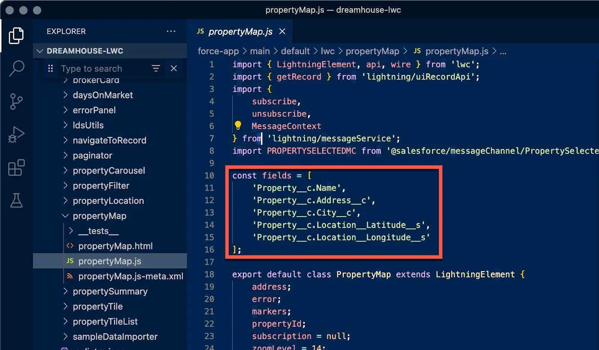

## Introduction
Part of the interview process, the job that I am shooting for may ask for experience regarding Salesforce. Althought I have no professional experience in Salesforce, they have a learning platform called Trailhead. They offer a variety of path for learning called Trails, Quests, and Modules. 

## Platform Development Basics
### Develop Without Code
The Salesforce platform serves as a SaaS, PaaS with several tools for creating solutions for an organization. They provide the tools and services for creating frontend and backend stacks on their platform, they use different names for them. Database tables are <em>objects</em>, columns in a database are <em>fields</em>, rows in a database are <em>records</em>. Each set of objects, fields, records, functionality, etc. constitute an <em>app</em>. Standard objects are built with Salesforce by default, user-defined objects are referred to as <em>custom objects</em>. Simple enough. 

Salesforce pushes something called <em>metadata-driven development model</em> essentially using the metadata generated to generate user experience/interface (graphs, lists, etc) for you. In this case metadata refers to the the fields that you (the developer) create for gathering the actual data. 

Some tools are the Schema Builder, Lightning App Builder, and Flow Builder. Each are GUI for creating a schema, application, flow, etc. without needing to code anything. 

### Coding with Salesforce
Salesforce uses a couple programming languages for its services.

#### Lightning Web Components (LWC) 
Lightning Web Components is a JavaScript-based user interface development framework, similar to React. Lightning web components have a .js file and .html file. They may also have .css to style them. Each component includes additional assets such as a test folder and a .xml file. There are included mobile simulators for testing components on a mobile view. 

#### Apex 
Apex is Salesforce' proprietary programming language which is strongly typed, object-oriented for adding business logic to system events (i.e. press button to update records). It has similar syntax to Java. For example, we can extend the functionality for Flows and Flow Builder using Apex.

#### Node.js 
Node.js is an asynchronous event-driven JavaScript runtime designed to build scalable network applications. It is used for developer tooling but not directly on Salesforce. New projects using Salesforce CLI include a set of Node.js scripts and utilities. 

### Extending Salesforce
Every object in your org has an API name for accessing data for that object. For example, Propertymap.js

The list of commonly used APIs Salesforce

| API | Description |
|-----|-------------|
| SOAP | Integrate org's data with other applications using standard SOAP protocols. |
| REST | Access objects in org w/ REST protocols. |
| Metadata | Manage customizations in org and build tools that manage your metadata model. |
| Tooling | Build custom development tools for platform applications. |
| Marketing Cloud | Expose Marketing Cloud Engagement capabilities with REST API and get comprehensive access to most email functionality with SOAP API. |
| Bulk | Load, delete, and perform asynchronous queries on large data sets. |
| Streaming | Send and receive notifications securely and efficiently. Notifications can reflect data changes in org, or custom events. |
| Connect REST | Build UI for Commerce, CMS-Managed Content, Experience Cloud Sites, Files, Notifications, Topics, and more. |
| Pub/Sub | A single interface for publishing/subscribing to platform events, including real-time event monitoring events and change data capture events. |
| GraphQL | New paradigm of sending and receiving data, offering clients a single endpoint to call for all data needed in one request. |
| Mobile SDK | Software development kit (not API), integrating native or hybrid mobile apps directly with Salesforce. |

#### Platform Events
<b>Platform Events</b> let you monitor systems and communicate changes to another systems using processes, flows, or Apex, or even external apps using Salesforce APIs. 

#### Heroku
HerokuConnect unifies Salesforce data with Heroku Postgres data without needing to move information across platforms. Heroku is a web solution for elastic scale for fast building and deployment of web apps. 

#### Salesforce Einstein
<b>Einstein</b> is an integrated set of AI technologies and it can be customized. Useful for predictive insight based on data and metadata. 