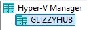
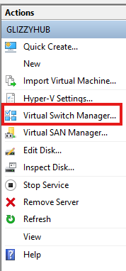
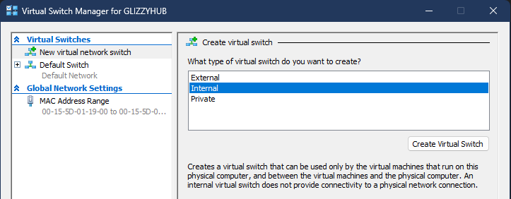
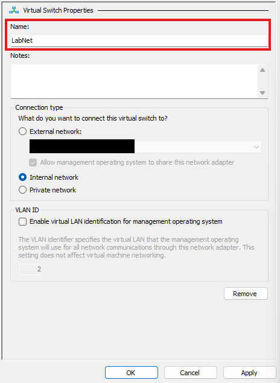

## Introduction
I have a decent background in networking including having a couple jobs in IT. In both of these environments, we used Active Directory for managing user profiles, with varying degree of usage between both jobs. Seeing the differences in setup between an enterprise environment like UC Davis, and another organization managing around 500 staff. I have grown more curious about how AD is setup, what it is built on, and more. 

## What is Virtuaization?
<b>Virtualization</b> allows a single machine to create several "imaginary" machines with the functionality of a real machine. This is done by making logical separations for physical resources that a machine has. The ability to virtualize allows you to emulate the abilities of a type of device without needing the physical device. In our case, we are going to use <em>hypervisor</em> for managing and allocating computer resources (e.g. CPU, RAM, storage) among virtual instances. 

## Virtual Network Setup (Hyper-V)
To start, we need to create structure for allowing the VMs we will create to communicate. <b>Virtual switches</b> are typically used for connecting VMs or connecting between virtual and physical networks. 

 

Select <b>New Virtual Network Switch</b>. When this window opens:

When prompted to choose the type of virtual switch, choose <b>internal</b> and then click on <b>Create Virtual Switch</b>.

For the my purposes, I will name the virtual switch <b>LabNet</b>. Then click on <b>Apply</b>.

## Types of Virtual Switches
Looking at the screenshots above, a couple questions may come up that I became curious about when creating the virtual switch.

| Type of Virtual Switch | Description |
|------------------------|-------------|
| External | Connects VMs to the <b>physical network</b> for communication with external devices. |
| Internal | Connects VMs to each other AND host machine, but NOT the internet or external network. |
| Private  | Connects VMs to each other ONLY, NOT to the host machine OR external network. |

## Sources
[Types of Virtual Switches](https://www.techtarget.com/searchitoperations/definition/virtual-switch#:~:text=A%20virtual%20switch%20(vSwitch)%20is,VMs%20or%20a%20physical%20network.) 
[Microsoft Learn: Hyper-V Virtual Switch](https://learn.microsoft.com/en-us/windows-server/virtualization/hyper-v-virtual-switch/hyper-v-virtual-switch)