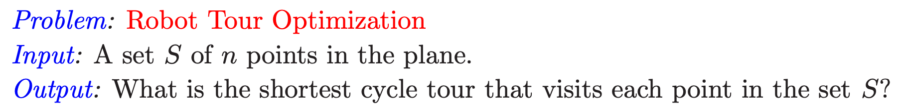
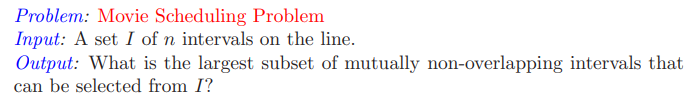
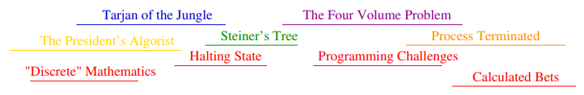

## Introduction
It has been quite a while since I have had to confront DSA. As such, I am going to start brushing up from the beginning. The resources I will use are Skiena's Algorithm Design Manual and CLS Introduction to Algorithms. 

## Robot Tour Optimization
The first part for demonstrating the difficulty of finding optimized solutions. A solution for one problem does not necessarily span to all types of that general problem. An issue for this example is that the shortest cycle between points. Different arrangements of points are given to explain the concept of heuristics and to introduce the concept of the <em>traveling salesman problem</em>. 

There will not be a general algorithmic solution for covering all the possible configurations of points in an optimized, timely manner. A <b>heuristic</b> will produce good enough results for the problem at hand, but not the correct solution. 

## Movie Scheduling Problem
The object as seen below is the fit the most non-overlapping movies into the schedule. We are given the condition that each movie pays the same. Meaning there is an incentive to get through the most movies. 

### Initial Approach
My initial thoughts are going towards finding the earliest jobs out of the set. Then compare them to see which one is the shortest, picking that, then continuing to choose from the subset of movies with a start date after the ending of the first movie. This will repeat until there are no more movies in the subset. 

### My Optimization
Thinking of optimization, I already know that my initial approach does not cover a bunch of cases. Picking the shortest does not mean optimal in many cases. Code aside, an ideal solution would be able to "see" all the possible options. Choose an initial that leaves the most possible options, and keep doing so until the end. What this may look like, is:

<ol>
  <li>Creating a set of initial movies picked based on an arbitrary range of early dates.
  <li>Choosing one, checking the next subset of movies available based on the end date of the current movie.
  <li>Iterate through the set of initial movies while keeping track of the maximum number of movies so far.
  <li>Return the subset with the largest number of members. 
</ol>

Thinking a bit more about this approach, I know that it is still not great. The time it would take to sift through all possible paths even with a small initial subset. As the pool of movies to choose gets larger, the time to compute scales exponentially. 

### Real Optimization
The biggest hurdle in optimizing the scheduling process is picking best initial movie. I admit, I overlooked the idea of choosing the movie that ends the earliest. 

:::important
Reasonable-looking algorithms can just as easily be incorrect. Correctness must be demonstrated. - Skiena 