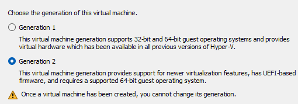
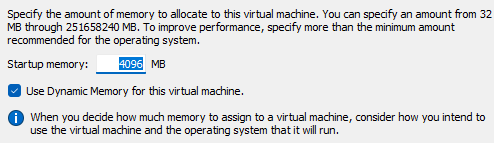
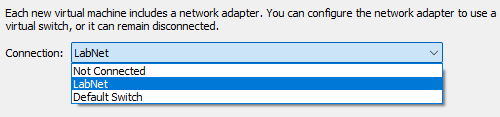
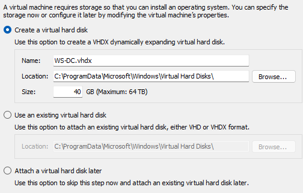
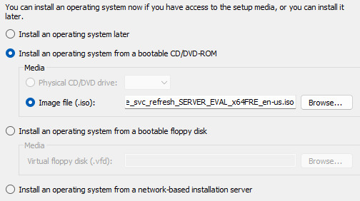

## Virtual Machines
Based on the last part of this series, virtual machines are emulated devices with their own resources. In this case, the VMs are not going to be performance intensive so the resources allocated will be minimal. Before starting, ensure that you have a bootable image downloaded for Windows Server 2025. You can find an evaluation version [here](https://www.microsoft.com/en-us/evalcenter/evaluate-windows-server-2025).

## Windows Server
As of now, Windows Server 2025 has been released so we will be using Windows Server as a Domain Controller on one of the VMs. Then use the other to simulate a computer we are going to connect to the domain. 

To start, we are going to name the VMs. The first will be named <b>WS-DC</b>. It then prompts to choose between Generation 1 and Generation 2. I will use Generation 2 because Generation 1 is geared towards older Operating Systems. 

### Assign Memory
This step is asking for the minimum amount of memory to assign to the VM at startup. <b>Startup memory</b> is RAM allocated at bootup. Allows the VM ability to boot and run services properly. <em>Too low</em> and the VM may fail to boot or run very slowly. There is an additional checkbox for using <em>Dynamic Memory</em>. If enabled, the VM can start with the specified Startup Memory and then scale up to the Maximum Memory as needed. 

### Configure Networking and Connect Virtual Hard Disk (VHD)
The next step is for configuring the networking options for the VM. I will choose the virtual switch I created before. 

VMs require storage in addition to RAM, in this step we allocate virtual hard disk space. 

### Adding the Image for Windows Server
In this stage, we are able to choose the bootable image we downloaded prior to the VM as an operating system. Choose <b>Install an operating system from a bootable CD/DVD-ROM</b>. Then choose <b>Image file (.iso)</b>. Click browse and then select Windows Server. 

After clicking Next you will see and overview of the options you have chosen for the VM, double check and then click Finish. 

## What's Next?
This virtual machine will act as a domain controller, in the next part we will boot up the VM we created and then setup Windows Server. 

## Sources
[Virtual Machine Generation](https://learn.microsoft.com/en-us/windows-server/virtualization/hyper-v/plan/Should-I-create-a-generation-1-or-2-virtual-machine-in-Hyper-V)  
[Creating a virtual machine](https://learn.microsoft.com/en-us/windows-server/virtualization/hyper-v/get-started/create-a-virtual-machine-in-hyper-v?tabs=hyper-v-manager)  
[Dynamic Memory](https://learn.microsoft.com/en-us/previous-versions/windows/it-pro/windows-server-2012-R2-and-2012/hh831766(v=ws.11))