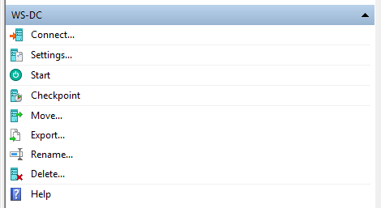

## Installing Windows Server
I am going to start the VM and boot from the Windows Server to start the installation. Click <b>Connect</b> and then initiate the boot sequence. 

When prompted to choose the Windows Server Edition, select <b>Windows Server Standard (Desktop Experience)</b> it includes the GUI for the operating system. Continuing through you will notice that the partition available for choosing where to install the OS is the VHD created prior.

## Starting Windows Server
After choosing to install, the processes will show an installation progress bar. Once the VM goes black, restart it. It will then ask for an administrator password. For the home lab, it can be simple. 

## Log In
After logging in is done, the Server Dashboard will open automatically. At this point, Windows Server is finished installing. 